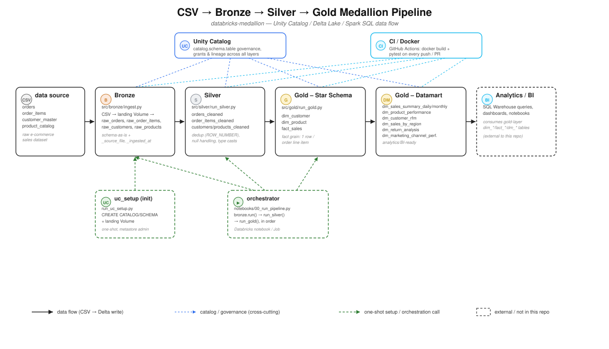

# Databricks Medallion

Medallion Architecture pipeline (Bronze → Silver → Gold) on Databricks, built with Spark SQL,
Delta Lake, and Unity Catalog. Source data is an e-commerce sales dataset (orders, order items,
customers, products).

## Architecture



Unity Catalog layout:

```
databricks_medallion
├── bronze  (raw_orders, raw_order_items, raw_customers, raw_products)
├── silver  (orders_cleaned, order_items_cleaned, customers_cleaned, products_cleaned)
└── gold    (fact_sales, dim_customer, dim_product,
             dm_sales_summary_daily, dm_product_performance,
             dm_customer_rfm, dm_sales_by_region, dm_return_analysis,
             dm_marketing_channel_performance)
```

**Bronze** is append-only: each run skips source files that haven't changed (by size +
last-modified) and appends a new snapshot when a file does change, so multiple versions of a
row can coexist over time, keyed by `_ingested_at`.

**Silver** deduplicates to latest-per-key via `MERGE`, and soft-deletes rows that disappear from
bronze — flagged via `_is_deleted`/`_deleted_at` rather than physically dropped, so removals stay
auditable. A row that reappears in bronze later is automatically "un-deleted".

**Gold** filters out soft-deleted rows and declares informational `PRIMARY KEY`/`FOREIGN KEY`
constraints on the star schema (`dim_customer`, `dim_product`, `fact_sales`) for BI-tool/Genie
discoverability (not enforced, per Unity Catalog's constraint model).

Gold layer has two kinds of tables:
- **Star schema** (no prefix) — `dim_customer`, `dim_product`, `fact_sales`
- **Datamart** (`dm_` prefix) — aggregated, analytics/BI-ready tables built on top of the star schema

| Table | Grain | Purpose |
|---|---|---|
| `dim_customer` | 1 row / customer | customer dimension |
| `dim_product` | 1 row / product | product dimension |
| `fact_sales` | 1 row / order line item | core sales fact |
| `dm_sales_summary_daily` | 1 row / day / channel | daily sales rollup |
| `dm_product_performance` | 1 row / product | sales & profit by product |
| `dm_customer_rfm` | 1 row / customer | Recency/Frequency/Monetary segmentation |
| `dm_sales_by_region` | 1 row / region+country+state | geographic sales performance |
| `dm_return_analysis` | 1 row / return_status+reason | return/cancellation breakdown |
| `dm_marketing_channel_performance` | 1 row / channel+campaign | marketing effectiveness |

## Repo structure

```
databricks-medallion/
├── databricks.yml        Databricks Asset Bundle: deploys the 3-task Job (bronze/silver/gold)
├── notebooks/            per-stage notebooks (01/02/03) used by the Job, plus a manual
│                         single-notebook runner (00_run_pipeline.py)
├── src/
│   ├── common/           shared config + SQL runner
│   ├── bronze/           CSV → Delta ingestion (Python)
│   ├── silver/           cleaning/dedup transforms (SQL)
│   └── gold/             joins + aggregations (SQL)
├── uc_setup/             one-time catalog/schema/grant bootstrap + source CSV upload
├── tests/                pytest unit tests (no cluster required)
├── data_source/          raw source CSVs
└── .github/workflows/    CI (builds the Docker image, runs pytest inside it, on push/PR)
```

## Prerequisites

- A Databricks workspace with Unity Catalog and serverless compute enabled (Free Edition works —
  serverless SQL warehouse, serverless compute, and a default Unity Catalog metastore are included).
- A personal access token: workspace **Settings → Developer → Access tokens → Generate new token**.
  Choose scope type **"Other APIs"** (not "BI Tools") and select these API scopes:
  - `databricks-connect` — required for `databricks-connect` (Spark Connect) itself; without it,
    every Spark call fails with `PERMISSION_DENIED: ... does not have required scopes:
    databricks-connect`.
  - `unity-catalog` — create/read catalog, schema, table, volume (uc_setup, bronze/silver/gold).
  - `files` — upload the source CSVs to the landing Volume (`uc_setup.upload_source_files`).
  - `sql` — SQL Warehouse access, if you query results outside the pipeline itself.
  - `clusters`, `command-execution` — provision and run commands on serverless compute.
  - `workspace`, `jobs` — only needed if you also deploy `databricks.yml` as a Databricks Job.
- A SQL Warehouse HTTP path: **SQL Warehouses → (your warehouse) → Connection details**.

## Setup

1. Copy `.env.example` to `.env` and fill in your workspace values:
   ```
   DATABRICKS_HOST=https://<your-workspace>.cloud.databricks.com
   DATABRICKS_TOKEN=<personal-access-token>
   DATABRICKS_HTTP_PATH=/sql/1.0/warehouses/<warehouse-id>
   ```
   `DATABRICKS_HOST`/`DATABRICKS_TOKEN` are picked up automatically by `databricks-connect`
   (via [src/common/spark_session.py](src/common/spark_session.py)) to run Spark against your
   workspace's serverless compute from your machine.

2. Install dependencies (Python 3.12):
   ```
   pip install -r requirements.txt
   ```

3. Bootstrap Unity Catalog (once, as a metastore admin):
   ```
   python -m uc_setup.run_uc_setup
   ```

4. Upload the CSVs under `data_source/` to the landing Volume
   (`/Volumes/databricks_medallion/bronze/landing` by default — see `SOURCE_VOLUME_PATH` in `.env`):
   ```
   python -m uc_setup.upload_source_files
   ```
   or upload them manually via Catalog Explorer.

5. Run the pipeline (bronze → silver → gold), either:
   - locally, calling each stage's `run()` — this executes against your Databricks workspace's
     serverless compute via `databricks-connect`, using the credentials from `.env`:
     ```
     python -m src.bronze.ingest
     python -m src.silver.run_silver
     python -m src.gold.run_gold
     ```
   - or import [notebooks/00_run_pipeline.py](notebooks/00_run_pipeline.py) into a Databricks
     Workspace and run it — there it uses the notebook's native Spark session instead of
     `databricks-connect`.
   - or deploy it as a proper Databricks Job (see below) — recommended for anything scheduled
     or production-like.

## Deploying as a Databricks Job

[databricks.yml](databricks.yml) is a [Databricks Asset Bundle](https://docs.databricks.com/aws/en/dev-tools/bundles/)
that deploys `medallion_pipeline` as a **3-task Job** — `bronze` → `silver` → `gold` — using
[notebooks/01_bronze.py](notebooks/01_bronze.py), [02_silver.py](notebooks/02_silver.py), and
[03_gold.py](notebooks/03_gold.py). Unlike the single-notebook run above, each task is
independently retryable from the Jobs UI: if `gold` fails, you can retry just that task instead
of re-running bronze and silver.

Requires the [Databricks CLI](https://docs.databricks.com/aws/en/dev-tools/cli/), authenticated
separately from the `.env` used by `databricks-connect` (e.g. `databricks auth login --host
<workspace-url>`):

```
databricks bundle validate
databricks bundle deploy -t dev
databricks bundle run medallion_pipeline -t dev
```

## Testing

```
pytest -v
```

Tests are schema/logic checks (SQL placeholder substitution, config, source CSV columns) that
run without a live Spark cluster, so they're safe to run in CI.

## Docker

A [Dockerfile](Dockerfile) is provided for a consistent Python 3.12 environment, without needing
a matching Python version installed on your machine:

```
docker build -t databricks-medallion .
docker run --rm databricks-medallion
```

This runs the test suite (same checks as `pytest -v`) inside the container, using a fake Spark
session — it does not need or use `.env`.

To run the actual pipeline against your Databricks workspace from the container instead, pass
your `.env` at run time and override the command:

```
docker run --rm --env-file .env databricks-medallion python -m uc_setup.run_uc_setup
docker run --rm --env-file .env databricks-medallion python -m uc_setup.upload_source_files
docker run --rm --env-file .env databricks-medallion python -m src.bronze.ingest
docker run --rm --env-file .env databricks-medallion python -m src.silver.run_silver
docker run --rm --env-file .env databricks-medallion python -m src.gold.run_gold
```

(`.env` is excluded from the image build via `.dockerignore` — it's only ever passed in at
`docker run` time, never baked into the image.)
